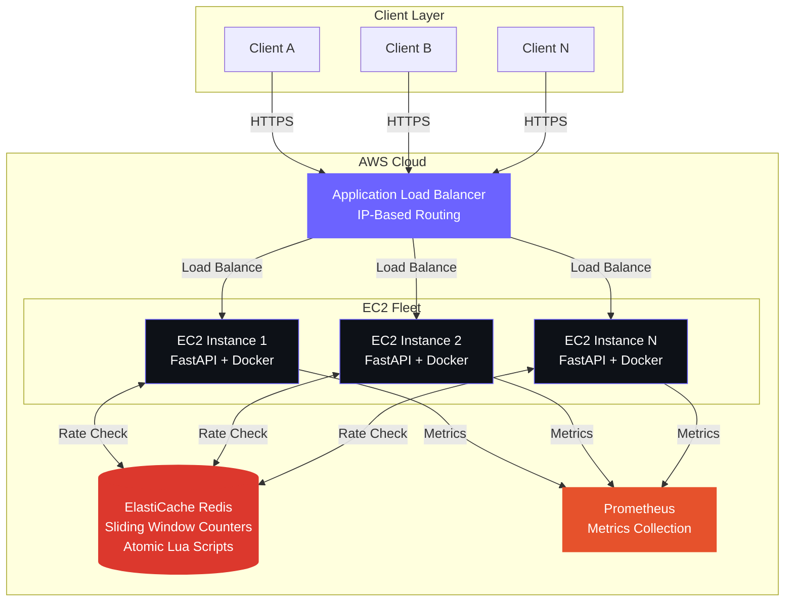
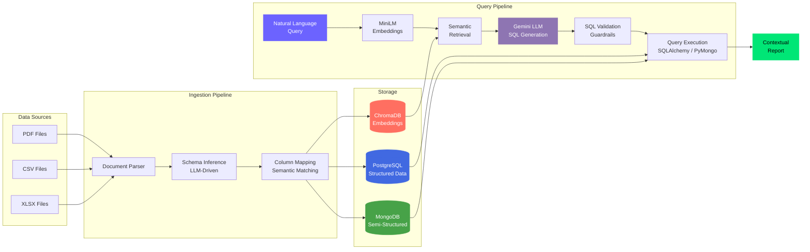
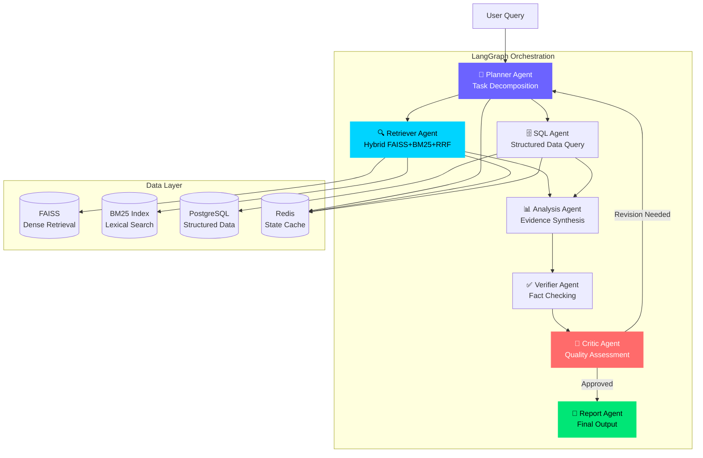
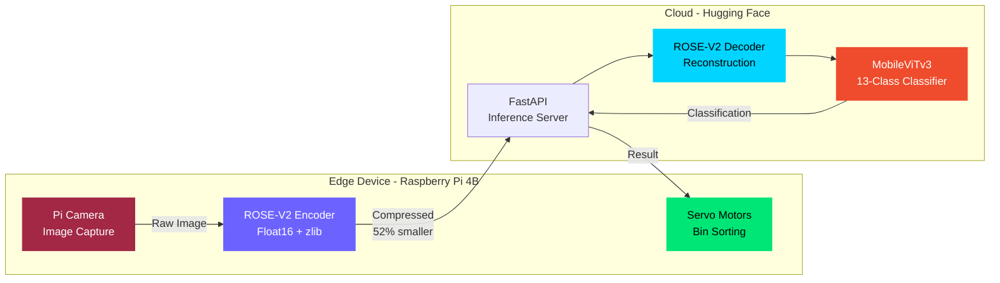

<a id="index"></a>

<!-- ═══════════════════════════════════════════════════════════════════════ -->
<!--                         ✦  THE GATEWAY  ✦                            -->
<!-- ═══════════════════════════════════════════════════════════════════════ -->

<div align="center">

<!-- Animated Constellation Header -->
<a href="https://guptavishn2711.vercel.app/">
  
</a>

<br/>

<!-- Dynamic Typing -->
[](https://github.com/Vishnugupta2711)

<br/>

<!-- Social Links -->
<a href="https://www.linkedin.com/in/vishnugupta2711/"></a>&nbsp;
<a href="mailto:guptavishnu2711@gmail.com"></a>&nbsp;
<a href="https://guptavishn2711.vercel.app/"></a>&nbsp;
<a href="https://ieeexplore.ieee.org/document/11280024"></a>

<br/><br/>

&nbsp;


</div>

<br/>

<!-- ═══════════════════════════════════════════════════════════════════════ -->
<!--                       ◉  NAVIGATION  ◉                               -->
<!-- ═══════════════════════════════════════════════════════════════════════ -->

<div align="center">

**[`◉ MISSION`](#-mission-briefing)** · **[`◎ SYSTEMS`](#-systems-deployed)** · **[`◈ ARCHITECTURE`](#-architecture)** · **[`◉ TECH`](#-command-deck)** · **[`◎ ACHIEVEMENTS`](#-mission-log)** · **[`◈ RESEARCH`](#-research-transmissions)** · **[`◉ TELEMETRY`](#-telemetry)** · **[`✦ PORTAL`](#-enter-the-universe)**

</div>

<br/>


<br/>

<!-- ═══════════════════════════════════════════════════════════════════════ -->
<!--                     ◉  MISSION BRIEFING  ◉                           -->
<!-- ═══════════════════════════════════════════════════════════════════════ -->

<h2 align="center">◉ Mission Briefing</h2>

<br/>

<div align="center">
<table>
<tr>
<td>

```yaml
# ━━━━━━━━━━━━━━━━━━━━━━━━━━━━━━━━━━━━━━━━━━━━
#  OPERATIVE: Vishnu Gupta
#  CLEARANCE: IEEE Published Researcher
#  STATUS:    Active — Open to Opportunities
# ━━━━━━━━━━━━━━━━━━━━━━━━━━━━━━━━━━━━━━━━━━━━

identity:
  location:    Kanpur, India
  education:   B.Tech CSE @ SRM Institute (CGPA: 9.43/10)
  graduation:  May 2027

current_mission:
  org:         Samsung PRISM — Research Intern
  objective:   Build schema-aware RAG pipelines for enterprise NL2SQL
  impact:      30% retrieval improvement · 10K+ records structured

research_output:
  paper:       "Real-Time Medical Waste Segregation using Vision Transformers"
  venue:       IEEE CICCS-2025 (First Author)
  domain:      Edge AI · Vision Transformers · Task-Aware Compression

operational_domains:
  - Distributed Systems & API Infrastructure
  - Large Language Models & Retrieval-Augmented Generation
  - Multi-Agent AI Orchestration (LangGraph)
  - Computer Vision & Edge-Cloud Inference
  - ML Observability & Data Drift Detection

combat_record:
  hackathons_won:      3
  top_finishes:        5
  certifications:      3  # AWS × 2, Oracle OCI GenAI
```

</td>
</tr>
</table>
</div>

<br/>


<br/>

<!-- ═══════════════════════════════════════════════════════════════════════ -->
<!--                     ◎  SYSTEMS DEPLOYED  ◎                           -->
<!-- ═══════════════════════════════════════════════════════════════════════ -->

<h2 align="center">◎ Systems Deployed</h2>

<p align="center"><em>Each system is a mission — engineered from research to deployment.</em></p>

<br/>

<!-- PROJECT 1: RateSentry -->
<table>
<tr>
<td width="100%">

<h3>🛡️ <a href="https://github.com/Vishnugupta2711/ratesentry">RateSentry</a> — Distributed Rate Limiter & API Gateway</h3>

<p>


</p>

> Production-grade distributed rate limiter using **Redis-backed sliding-window counters** and **atomic Lua scripts** for race-condition-free throttling across multiple AWS EC2 instances behind an Application Load Balancer.

<table>
<tr>
<td align="center"><strong>237 RPS</strong><br/><sub>Sustained Throughput</sub></td>
<td align="center"><strong>420ms</strong><br/><sub>p99 Latency</sub></td>
<td align="center"><strong>5,710</strong><br/><sub>Rate Limits Enforced</sub></td>
<td align="center"><strong>Zero</strong><br/><sub>Counter Drift</sub></td>
</tr>
</table>

<details>
<summary><strong>Key Engineering</strong></summary>
<br/>

- Sliding-window counters with **atomic Lua scripts** — eliminates race conditions across distributed nodes
- **AWS EC2 + ElastiCache Redis + ALB** — production cloud deployment with IP-based throttling
- **Prometheus** observability — real-time metrics for rate-limit enforcement, latency, and error rates
- Load tested with **Locust** at 100 concurrent users — validated distributed consistency

</details>

<a href="https://github.com/Vishnugupta2711/ratesentry"></a>
<a href="https://vishnugupta2711.github.io/ratesentry/"></a>

</td>
</tr>
</table>

<br/>

<!-- PROJECT 2: ROSE-V2 / EcoVision -->
<table>
<tr>
<td width="100%">

<h3>🧬 <a href="https://github.com/Vishnugupta2711/Real-time-medical-waste-segregation-using-transformers-and-edge-AI-solutions.git">ROSE-V2 / EcoVision</a> — Edge AI Waste Segregation · IEEE Published</h3>

<p>


</p>

> **IEEE CICCS-2025 published.** Task-aware encoder-decoder compression framework (ROSE-V2) for edge–cloud medical waste classification. **Winner of Tem-E-thon 2025** — Top 30 from 1,000+ teams. Led a 3-member team to build and deploy in 24 hours.

<table>
<tr>
<td align="center"><strong>94–98%</strong><br/><sub>Classification Accuracy</sub></td>
<td align="center"><strong>52%</strong><br/><sub>Payload Reduction</sub></td>
<td align="center"><strong>70%</strong><br/><sub>Faster Network Transfer</sub></td>
<td align="center"><strong>3×</strong><br/><sub>Faster E2E Inference</sub></td>
</tr>
</table>

<details>
<summary><strong>Key Engineering</strong></summary>
<br/>

- Benchmarked **7+ autoencoder baselines and 5 ViT architectures** on a 13-class, 6,156-image dataset
- **ROSE-V2** split edge-cloud inference — Float16 + zlib compression for semantic-preserving transmission
- Deployed on **Raspberry Pi 4B** (edge) → **Hugging Face Cloud** (inference) via FastAPI
- Published: [IEEE Xplore](https://ieeexplore.ieee.org/document/11280024)

</details>

<a href="https://github.com/Vishnugupta2711/Real-time-medical-waste-segregation-using-transformers-and-edge-AI-solutions.git"></a>
<a href="https://www.youtube.com/shorts/wnGDNTNKzoQ"></a>
<a href="https://ieeexplore.ieee.org/document/11280024"></a>

</td>
</tr>
</table>

<br/>

<!-- PROJECT 3: Casefile -->
<table>
<tr>
<td width="100%">

<h3>🕵️ <a href="https://github.com/Vishnugupta2711/casefile">Casefile</a> — Multi-Agent Enterprise Investigation Platform</h3>

<p>


</p>

> Multi-agent investigation framework orchestrating **7 specialized agents** — Planner, Retriever, SQL, Analysis, Verifier, Critic, and Report — for evidence-grounded reasoning over heterogeneous enterprise data.

<table>
<tr>
<td align="center"><strong>7</strong><br/><sub>Orchestrated Agents</sub></td>
<td align="center"><strong>4</strong><br/><sub>Retrieval Configs Benchmarked</sub></td>
<td align="center"><strong>Hybrid</strong><br/><sub>FAISS + BM25 + RRF</sub></td>
<td align="center"><strong>Grounded</strong><br/><sub>Citation-Aware Reasoning</sub></td>
</tr>
</table>

<details>
<summary><strong>Key Engineering</strong></summary>
<br/>

- **LangGraph** multi-agent orchestration with self-critique and verification loops
- Hybrid retrieval: **FAISS dense + BM25 lexical + RRF fusion + reranking**
- Benchmarked with **Recall@5, NDCG@10, citation grounding, faithfulness, latency**
- PostgreSQL + Redis for state management and caching

</details>

<a href="https://github.com/Vishnugupta2711/casefile"></a>

</td>
</tr>
</table>

<br/>

<!-- PROJECT 4: MLGuard -->
<table>
<tr>
<td width="100%">

<h3>📊 <a href="https://github.com/Vishnugupta2711/DATA_DRIEF_MONITOR">MLGuard</a> — Enterprise ML Observability & Data Drift Intelligence</h3>

<p>


</p>

> Unified drift detection framework combining **4 complementary signals** — KS testing, Chi-Square, PSI, and transformer-based semantic similarity — with LLM-powered explainability for automated root-cause analysis.

<table>
<tr>
<td align="center"><strong>4</strong><br/><sub>Drift Detection Signals</sub></td>
<td align="center"><strong>3</strong><br/><sub>Shift Types Detected</sub></td>
<td align="center"><strong>LLM</strong><br/><sub>Root-Cause Analysis</sub></td>
<td align="center"><strong>Auto</strong><br/><sub>Remediation Recommendations</sub></td>
</tr>
</table>

<details>
<summary><strong>Key Engineering</strong></summary>
<br/>

- Multi-metric framework: **KS test + Chi-Square + PSI + semantic similarity**
- Controlled drift experiments benchmarked against PSI-only detection baseline
- **LLM-powered explainability layer** — synthesizes statistical signals into actionable diagnostics
- Unified severity scoring: Low → Medium → High → Critical

</details>

<a href="https://github.com/Vishnugupta2711/DATA_DRIEF_MONITOR"></a>

</td>
</tr>
</table>

<br/>

<!-- PROJECT 5: Samsung PRISM -->
<table>
<tr>
<td width="100%">

<h3>🧠 <a href="https://github.com/Vishnugupta2711/GEN_AI_QueryBasedReports">Samsung PRISM — RAG Reporting System</a></h3>

<p>


</p>

> Schema-aware RAG pipeline for enterprise reporting — ingests PDFs, CSVs, XLSX and generates contextual reports from natural-language queries via NL2SQL reasoning with semantic retrieval and SQL validation guardrails.

<table>
<tr>
<td align="center"><strong>30%</strong><br/><sub>Retrieval Improvement</sub></td>
<td align="center"><strong>10K+</strong><br/><sub>Records Structured</sub></td>
<td align="center"><strong>Hours → Min</strong><br/><sub>Report Generation</sub></td>
<td align="center"><strong>Multi-DB</strong><br/><sub>SQL + MongoDB</sub></td>
</tr>
</table>

<a href="https://github.com/Vishnugupta2711/GEN_AI_QueryBasedReports"></a>
<a href="https://www.youtube.com/watch?v=5Ied6-Ck5FE"></a>

</td>
</tr>
</table>

<br/>

<!-- PROJECT 6: AURA++ -->
<table>
<tr>
<td width="100%">

<h3>💚 <a href="https://github.com/ak8057/mental_health_v1.0.git">AURA++</a> — Accessible AI Mental Health Platform · HackZ'24 Runner-Up</h3>

<p>


</p>

> Multimodal accessible mental health platform with NLP conversational AI, sentiment analysis, VR therapy, IoT vitals monitoring, and gesture-based navigation. **1st Runner-Up at HackZ'24** — led 4-member team, built in 24 hours. Top 20 from 500+ submissions.

<a href="https://github.com/ak8057/mental_health_v1.0.git"></a>
<a href="https://www.youtube.com/watch?v=cBjXdItvFVY"></a>

</td>
</tr>
</table>

<br/>


<br/>

<!-- ═══════════════════════════════════════════════════════════════════════ -->
<!--                     ◈  ARCHITECTURE  ◈                               -->
<!-- ═══════════════════════════════════════════════════════════════════════ -->

<h2 align="center">◈ Architecture</h2>

<p align="center"><em>How the systems are wired under the hood.</em></p>

<br/>

<details>
<summary><strong>🛡️ RateSentry — Distributed Architecture</strong></summary>
<br/>



</details>

<details>
<summary><strong>🧠 Samsung PRISM — RAG Pipeline Architecture</strong></summary>
<br/>



</details>

<details>
<summary><strong>🕵️ Casefile — Multi-Agent Orchestration</strong></summary>
<br/>



</details>

<details>
<summary><strong>🧬 ROSE-V2 — Edge-Cloud Inference Pipeline</strong></summary>
<br/>



</details>

<br/>


<br/>

<!-- ═══════════════════════════════════════════════════════════════════════ -->
<!--                      ◉  COMMAND DECK  ◉                              -->
<!-- ═══════════════════════════════════════════════════════════════════════ -->

<h2 align="center">◉ Command Deck</h2>

<p align="center"><em>Battle-tested tools in the arsenal.</em></p>

<br/>

<div align="center">

| Domain | Technologies |
|:---|:---|
| **Languages** |       |
| **AI / ML** |      |
| **LLMs & RAG** |      |
| **Backend** |     |
| **Frontend** |     |
| **Databases** |     |
| **Cloud & DevOps** |       |
| **Evaluation** |      |

</div>

<br/>


<br/>

<!-- ═══════════════════════════════════════════════════════════════════════ -->
<!--                      ◎  MISSION LOG  ◎                               -->
<!-- ═══════════════════════════════════════════════════════════════════════ -->

<h2 align="center">◎ Mission Log</h2>

<p align="center"><em>Engagements. Victories. Evidence.</em></p>

<br/>

<div align="center">

| | Achievement | Context | Scale |
|:---:|:---|:---|:---|
| 🌍 | **TCS CodeVita Season 12** | Global Rank **499** | 537,000+ registrants |
| 🎓 | **Amazon ML Summer School** | Selected for 2026 cohort | Prestigious ML program |
| 🥇 | **Tem-E-thon 2025** | **Winner** — 24hr hackathon by Temenos | Top 30 from 1,000+ |
| 🥇 | **SRiJAN 2026** | **Winner** — Data & AI Track | University competition |
| 🏅 | **Barclays HACK-O-HIRE** | **Top 8 Finalist** — 2025 | National hackathon |
| 🥈 | **HackZ'24** | **1st Runner-Up** — Anna University | Top 20 from 500+ |
| 🥉 | **Hack of Duty** | **2nd Runner-Up** — ACM-SIGKDD | National hackathon |


</div>

<br/>


<br/>

<!-- ═══════════════════════════════════════════════════════════════════════ -->
<!--                  ◈  RESEARCH TRANSMISSIONS  ◈                        -->
<!-- ═══════════════════════════════════════════════════════════════════════ -->

<h2 align="center">◈ Research Transmissions</h2>

<br/>

<div align="center">
<table>
<tr>
<td>

### 📄 IEEE CICCS-2025 — First Author

**"Real-Time Medical Waste Segregation using Vision Transformers and Edge AI Solutions"**

*V. Gupta et al.* — First International Conference on Intelligent Computing and Communication Systems (CICCS), IEEE, 2025

Proposed ROSE-V2, a task-aware encoder-decoder compression framework for edge-cloud medical waste classification. Benchmarked 7+ autoencoder baselines and 5 Vision Transformer architectures. Achieved 52% payload reduction and 3× faster inference with preserved classification accuracy.

<br/>

<a href="https://ieeexplore.ieee.org/document/11280024"></a>

</td>
</tr>
</table>
</div>

<br/>

<!-- ═══════════════════════════════════════════════════════════════════════ -->
<!--                   CLEARANCE BADGES (Certifications)                   -->
<!-- ═══════════════════════════════════════════════════════════════════════ -->

<h3 align="center">Clearance Badges</h3>

<div align="center">

<a href="https://www.credly.com/badges/77a63626-7191-40cc-b812-2ae52eec6754"></a>&nbsp;
<a href="https://www.credly.com/earner/earned/badge/a9b54ec9-24c9-4063-8450-0f44fc6af563"></a>&nbsp;
<a href="https://catalog-education.oracle.com/ords/certview/sharebadge?id=DA85DD5707950BDD3F093517DE009BA03E265786A23B11822FE1119AFA1D25C8"></a>

</div>

<br/>


<br/>

<!-- ═══════════════════════════════════════════════════════════════════════ -->
<!--                       ◉  TELEMETRY  ◉                               -->
<!-- ═══════════════════════════════════════════════════════════════════════ -->

<h2 align="center">◉ Telemetry</h2>

<br/>

<div align="center">

<table>
  <tr>
    <td>
      
    </td>
    <td>
      
    </td>
  </tr>
</table>

<br/>


<br/>


</div>

<br/>


<br/>

<!-- ═══════════════════════════════════════════════════════════════════════ -->
<!--                    ✦  ENTER THE UNIVERSE  ✦                          -->
<!-- ═══════════════════════════════════════════════════════════════════════ -->

<h2 align="center" id="-enter-the-universe">✦ Enter the Universe</h2>

<br/>

<div align="center">

<a href="https://guptavishn2711.vercel.app/">
  
</a>

<br/><br/>

<sub>A cinematic, interactive experience built with Three.js, GSAP, and glass morphism.<br/>
Particles. Parallax. Architecture diagrams that come alive.<br/>
Every pixel has intention. Every animation tells a story.</sub>

</div>

<br/>

<!-- ═══════════════════════════════════════════════════════════════════════ -->
<!--                          ✦  FOOTER  ✦                                -->
<!-- ═══════════════════════════════════════════════════════════════════════ -->

<div align="center">

<br/>

```
╔══════════════════════════════════════════════════════════════╗
║                                                              ║
║    "The universe is under no obligation to make sense        ║
║     to you. But it rewards those who build within it."       ║
║                                                              ║
║                                        — Systems Philosophy  ║
║                                                              ║
╚══════════════════════════════════════════════════════════════╝
```

<br/>


</div>

[⬆ **Back to the top**](#index)
